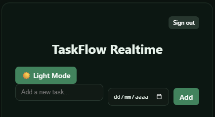
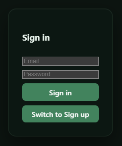
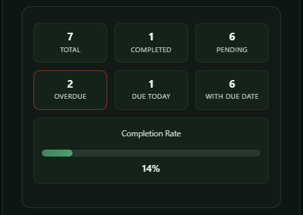
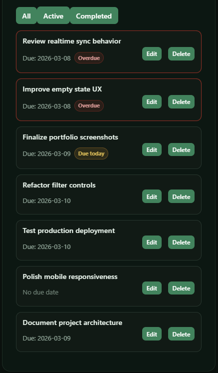

# TaskFlow Realtime

🔗 **Live Demo:** https://first-app-bay-seven.vercel.app/  
⚡ **Built with:** React • Supabase • Vite • Vercel

TaskFlow Realtime is a full-stack task management application built with React, Vite, Supabase, and Vercel.

The app supports authentication, realtime task synchronization across sessions, due-date tracking, filtering, editing, and production deployment.

---

## Preview



---

## Features

- User authentication with Supabase Auth
- Secure multi-user data access using Row Level Security (RLS)
- Realtime task synchronization across browser tabs
- Create, edit, complete, and delete tasks
- Due dates with overdue and due-today indicators
- Task filtering (all, active, completed)
- Dark mode with persistence
- Stats dashboard with completion metrics
- Loading states and error handling for async operations
- Production deployment with Vercel

---

## Tech Stack

### Frontend
- React
- Vite
- JavaScript
- CSS

### Backend / Cloud
- Supabase Auth
- Supabase Postgres
- Supabase Realtime
- Row Level Security (RLS)

### Deployment
- Vercel

---

## Architecture

The app follows a layered structure:

- `pages/` → page-level UI
- `components/` → reusable UI components
- `hooks/` → custom React hooks for stateful logic
- `services/` → database interaction layer
- `lib/` → Supabase client setup

### Data Flow

```
Dashboard UI → useTasks hook → tasksService → Supabase
```

This separation keeps UI, business logic, and data access cleanly organized.

---

## Screenshots

### Login


### Dashboard


### Stats Overview


### Task Editing


---

## Local Setup

1. Clone the repository

```
git clone https://github.com/yourusername/first-app.git
```

2. Install dependencies

```
npm install
```

3. Run the development server

```
npm run dev
```

---

## Live Deployment

The application is deployed on **Vercel** and connected to **Supabase** for backend services.

🔗 https://first-app-bay-seven.vercel.app/